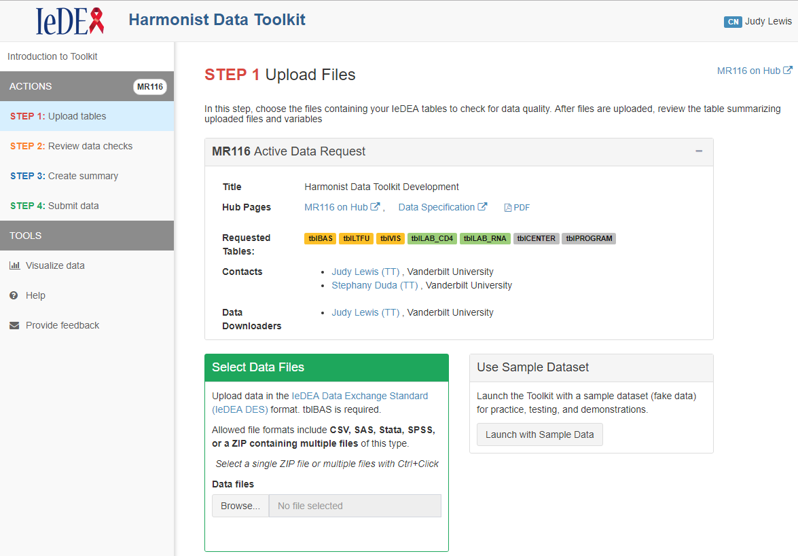

## The challenge

Users of a shinydashboard application with multiple tabs may think they can use the browser navigation arrows to return to a previous tab and be very disappointed to find the application terminated. This is because a shiny application is technically a single web page.

In my [Shinydashboard application](https://iedeadata.org/iedea-harmonist/), the sidebar contains a menu of tabs that represent a workflow. Users of this application are typically uploading very large datasets.

The tab labelled Step 1 contains a Shiny fileInput prompt for users to browse and select files to upload to the application. In Step 2, an interactive data table displays the results of data quality checks performed on data uploaded in Step 1. In Step 3 users can generate reports summarizing the dataset and its quality. Authenticated users have the option in Step 4 to store the dataset in secure cloud storage for retrieval by investigators who requested data. Another optional tab leads users to interactive graphical exploration of the dataset. 

Since a Shiny app is technically a single webpage, using the browser's "back" button results in terminating the application. Users of my application might expect to be able to move through the steps with the browser navigation buttons as an alternative to the sidebar menu. It would be frustrating to click the browser's back arrow from Step 3, expecting to return to exploring the data quality errors found in the uploaded dataset, but instead arrive at a previously visited website and find that all data and quality check results had been lost. 

One [approach to enabling the use of web browser navigation buttons within a Shiny app](https://github.com/daattali/advanced-shiny/tree/master/navigate-history) has been proposed by Dean Attali, makes use of his shinyjs package, and requires an understanding of javascript. This impressive solution saves the state of the application in the URL.

My goal was to come up with a simple (non-javascript) method to make the browser arrows button act as an alternate way to navigate through my Shinydashboard application. My solution makes use of Shiny's reactive values, getQueryString and updateQueryString Shiny functions to update the URL to include the name of the current tab. 

The code presented here provides a small example to illustrate this method. 

Note: In the shinydashboard application mentioned above, returning to the state of the application after exiting the application is not desired, since users are uploading large, confidential datasets that should be deleted upon termination of the session. 

